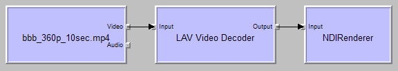

# NDIRenderer
A simple DirectShow video renderer that renders to NewTek's NDI.

To build the project, you need a copy of the "NewTek NDI 3.5 SDK". Either create a folder called "NDISDK" in the solution folder and copy folders "Include" and Lib" from the SDK's folder into this new folder, or update the include path in the project settings to point to your original SDK installation.

*Screenshots*

NDIRenderer in GraphStudio, playing a 360p H.264 MP4 video:

